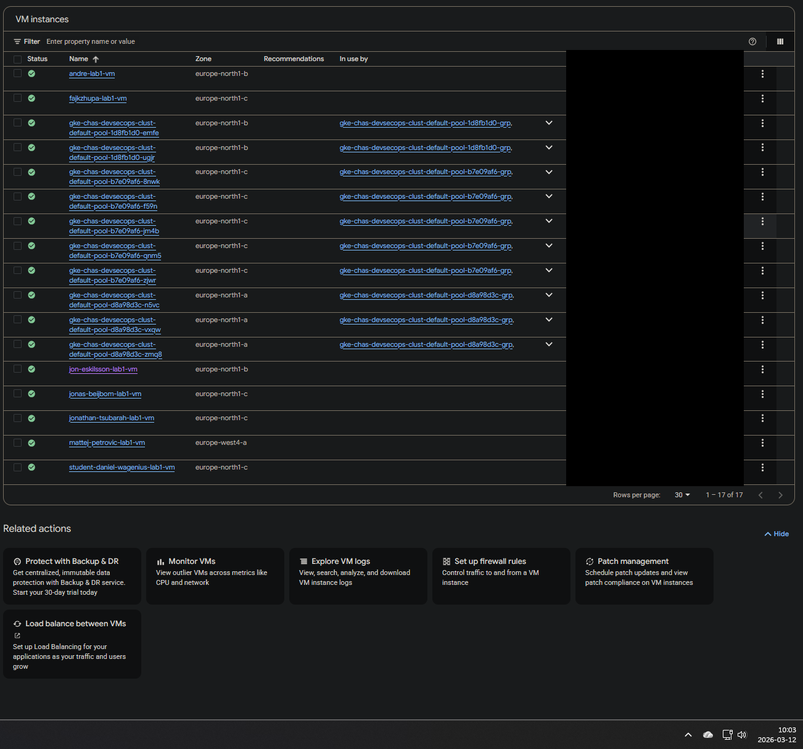
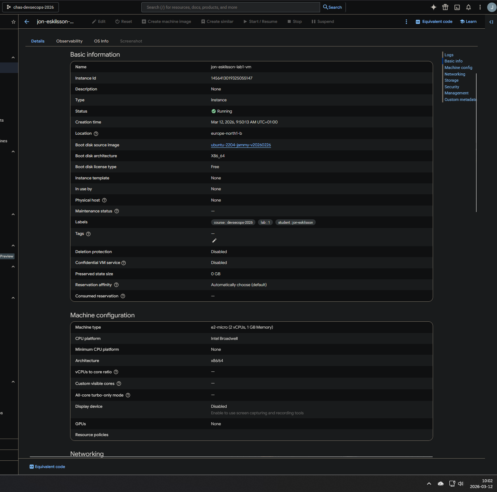
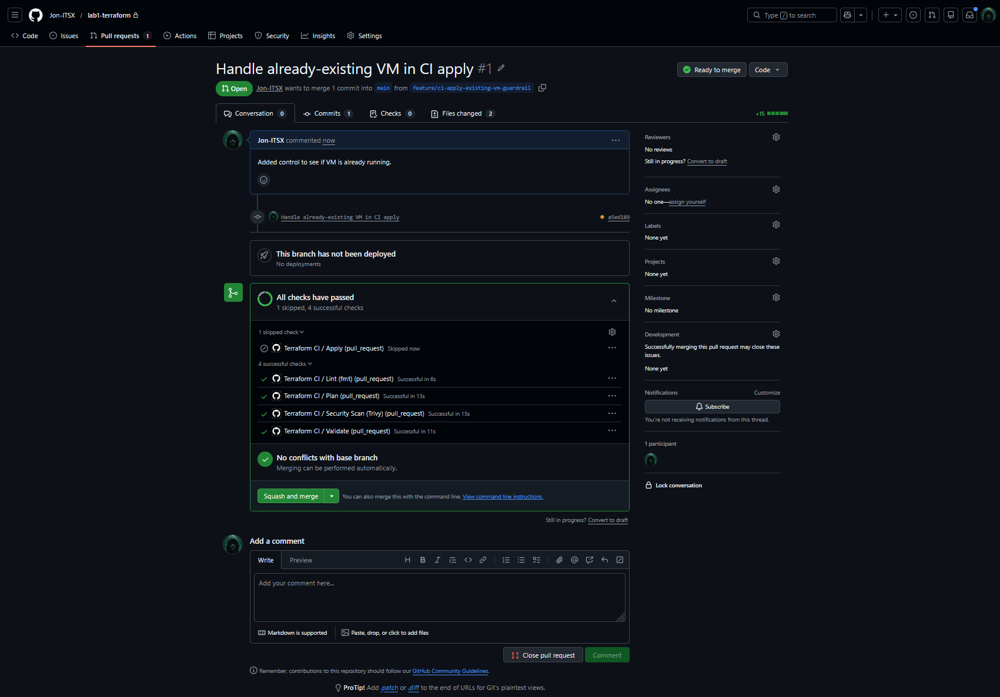

# Lab 1 – Terraform + GCP

Terraform-kod som skapar en härdad Linux-VM i GCP med säkerhetskontroller i GitHub Actions.

## Vad projektet skapar

- Linux-VM (`google_compute_instance`) med Ubuntu 22.04 LTS
- Startup-script med CIS Ubuntu 22.04 Level 1-härdning
- Shielded VM (Secure Boot, vTPM, Integrity Monitoring)
- Daglig snapshot-policy med 7 dagars retention (backup-strategi)
- Remote state i GCS (bucket konfigurerad via `GCS_BUCKET` secret)
- Trivy IaC-scan med blockerande `CRITICAL`-gate
- Terraform `fmt`, `validate`, `plan`, `apply` i CI
- Auto-destroy workflow (manuell trigger)
- DR-dokumentation med RPO/RTO

---

## Säkerhetsbeslut – motivering

### Shielded VM (Secure Boot, vTPM, Integrity Monitoring)
Shielded VM skyddar mot att skadlig kod injiceras i bootprocessen eller firmware innan operativsystemet startar. Secure Boot verifierar att bara signerad kod körs vid uppstart. vTPM möjliggör hårdvarubaserad nyckelhantering och attesterering. Integrity Monitoring detekterar om boot-mätvärdena förändras mellan omstarter — ett tidigt tecken på kompromiss. Dessa kontroller är aktiverade i `main.tf` och kräver inget extra script.

### CIS Ubuntu 22.04 Level 1 via startup.sh
CIS Benchmark är en erkänd industristandard för OS-härdning. Level 1 väljs specifikt för att ge ett starkt grundskydd utan att bryta normal drift — Level 2 innehåller kontroller som kan påverka tillgängligheten. Härdningen är gjord i startup.sh scriptet för att garantera att den tillämpas automatiskt vid varje ny VM, oavsett om den skapas manuellt eller via CI.

### Trivy IaC-scan med blockerande CRITICAL-gate
Statisk analys av Terraform-koden hittar felkonfigurationer *innan* de når GCP. CRITICAL-fynden blockerar pipelinen eftersom de representerar sårbarheter som aktivt utnyttjas i produktion (t.ex. exponerade tjänster, avsaknad av kryptering).
HIGH/MEDIUM/LOW laddas upp som artefakt för manuell granskning men blockerar inte — en avvägning mellan säkerhet och produktivitet.

### Secrets lagrade i GitHub Secrets, inte i kod
Credentials i klartext i repot är en av de vanligaste orsakerna till dataintrång. GitHub Secrets krypteras i vila och exponeras aldrig i loggar. SA-nyckeln sparas därför inte lokalt för att minimera risken för kompromiss — om en utvecklares dator komprometteras finns inga credentials att komma åt.

### Concurrency-lås i CI-pipelinen
Två parallella `terraform apply`-körningar på samma state-fil kan korruptera state eller skapa duplicerade resurser. Concurrency-gruppen säkerställer att bara en körning per branch körs åt gången. `cancel-in-progress: false` skyddar en pågående apply från att avbrytas mitt i körningen, vilket annars kan lämna infrastrukturen i ett halvfärdigt tillstånd.

### Auto-destroy med manuell trigger och bekräftelsefält
Destroy-workflowet kan bara triggas manuellt och kräver att operatören skriver `DESTROY` i ett bekräftelsefält. Detta är medveten "human friction" — ett enkelt klick ska aldrig kunna riva ned produktionsmiljön. Workflowet är kopplat till GitHub Environment `production` som kan konfigureras med obligatoriska granskare för ytterligare skydd.

---

## Autentisering

I projektet används delad service account-nyckel (`GCP_SA_KEY`).

1. Nyckeln hämtas via Mission Control → Credentials → Request `GCP_SA_KEY`.
2. Nyckeln läggs till GitHub som repository secret: `GCP_SA_KEY`.
3. VIll man använda lokalt: sätt miljövariabeln `TF_VAR_gcp_sa_key_json` till hela JSON-innehållet.

**PowerShell (Windows):**
```powershell
$env:TF_VAR_gcp_sa_key_json = Get-Content -Raw .\gcp-sa-key.json
```

**Bash (Linux/macOS):**
```bash
export TF_VAR_gcp_sa_key_json=$(cat ./gcp-sa-key.json)
```

---

## Konfiguration

Skapa en lokal `terraform.tfvars` från `terraform.example.tfvars`:

```hcl
project_id   = "your-project-id"
region       = "region"
zone         = "zone"
machine_type = "machine"
student_id   = "your-name"
```

---

## Körning lokalt

```bash
terraform init \
  -backend-config="bucket=$GCS_BUCKET" \
  -backend-config="prefix=lab1/jon-eskilsson"
terraform fmt -recursive
terraform validate
terraform plan
terraform apply
```

---

## Secrets i GitHub

| Secret              | Obligatorisk | Beskrivning                                    |
|---------------------|--------------|------------------------------------------------|
| `GCP_SA_KEY`        | Ja           | Service account-nyckel (JSON)                  |
| `GCP_PROJECT_ID`    | Ja           | GCP-projekt-ID                                 |
| `STUDENT_ID`        | Ja           | Studentidentifierare                           |
| `GCS_BUCKET`        | Ja           | GCS-bucket för remote state                                  |
| `GCP_REGION`        | Ja           | Standardvärde: `europe-north1`                 |
| `GCP_ZONE`          | Nej          | Standardvärde: `europe-north1-b`               |
| `GCP_MACHINE_TYPE`  | Nej          | Standardvärde: `e2-micro`                      |

---

## Remote State (GCS)

Terraform-state lagras i en delad GCS-bucket för att möjliggöra samarbete och säker återhämtning.

Bucket och prefix konfigureras i `backend.tf`. Kör `terraform init` för att initiera backend.

> **Notering:** Koden för remote state är fullt implementerad (`backend.tf`, pipeline-stöd). Bucket-skapande blockerades av att service account-et i den delade GCP-miljön saknar `storage.buckets.create`-behörighet. 
Detta är en miljöbegränsning. — `terraform plan` och `terraform apply` hoppar över gracefully och skriver ut en tydlig informationstext när `GCS_BUCKET`-hemligheten saknas.

---

## Backup-strategi

En daglig snapshot-policy skapas via `google_compute_resource_policy` och kopplas till boot-disken:

- Schema: varje dag kl. 03:00 UTC
- Retention: 7 dagar
- Vid diskradering: snapshots behålls (`KEEP_AUTO_SNAPSHOTS`)

Se [docs/dr-documentation.md](docs/dr-documentation.md) för RPO/RTO och återhämtningsprocedur.

---

## CIS Benchmark – VM-härdning

`startup.sh` implementerar CIS Ubuntu 22.04 LTS Level 1-kontroller:

| CIS-sektion | Åtgärd                                                                  |
|-------------|-------------------------------------------------------------------------|
| 1.1         | Inaktivera oanvända filsystem (cramfs, hfs, udf m.fl.)                  |
| 1.1.2       | `/tmp` med `nodev,nosuid,noexec`                                        |
| 1.2         | Automatiska säkerhetsuppdateringar (`unattended-upgrades`)              |
| 1.3         | AIDE filesystem integrity monitoring                                    |
| 1.4         | Shielded VM: Secure Boot, vTPM, Integrity Monitoring (Terraform)        |
| 1.5         | Core dumps inaktiverade, ASLR aktiverat                                 |
| 1.6         | AppArmor enforce-läge                                                   |
| 1.7         | Varningsbanner på `/etc/issue` och `/etc/issue.net`                     |
| 2.x         | Onödiga tjänster inaktiverade och maskerade                             |
| 2.3         | Onödiga klientpaket borttagna (telnet, ftp m.fl.)                       |
| 3.1–3.3     | Nätverkshärdning via sysctl (IP-forwarding, ICMP-redirects m.m.)        |
| 3.4         | Oanvända nätverksprotokoll inaktiverade (dccp, sctp, rds, tipc)         |
| 3.5         | UFW-brandvägg: deny incoming, allow SSH                                 |
| 4.1         | auditd med regler för tids-, behörighets-, nätverks- och moduländringar |
| 4.2         | rsyslog aktiverat                                                       |
| 5.2         | SSH-härdning: PermitRootLogin no, starka algoritmer, timeout            |
| 5.3         | PAM: lösenordskvalitet (minlen 14, komplexitet)                         |
| 5.4         | Lösenordspolicy, root låst, shell-timeout 15 min, umask 027             |
| 6.x         | Filrättigheter på `/etc/shadow`, `/etc/passwd`, `/root` m.fl.           |

---

## Auto-Destroy Workflow

Infrastrukturen kan rivas ned via GitHub Actions utan lokal Terraform-installation:

1. Gå till **Actions → Terraform Destroy → Run workflow**
2. Skriv `DESTROY` i bekräftelsefältet
3. Pipelinen kör `terraform destroy -auto-approve` mot GCS-statet

---

## Hantering av kapacitetsfel i zon

`zone` är en explicit Terraform-variabel och CI-`apply` har automatisk zon-fallback (`a → b → c`) vid GCP-kapacitetsbrist för `e2-micro`.

---

## Bilagor

### VM skapad i GCP





### PR med synlig pipelinekörning



---

## Dokumentation

- [DR-dokumentation (RPO/RTO)](docs/dr-documentation.md)
- [CI/CD-noter och säkerhetsbeslut](docs/github-ruleset-and-ci-notes.md)
